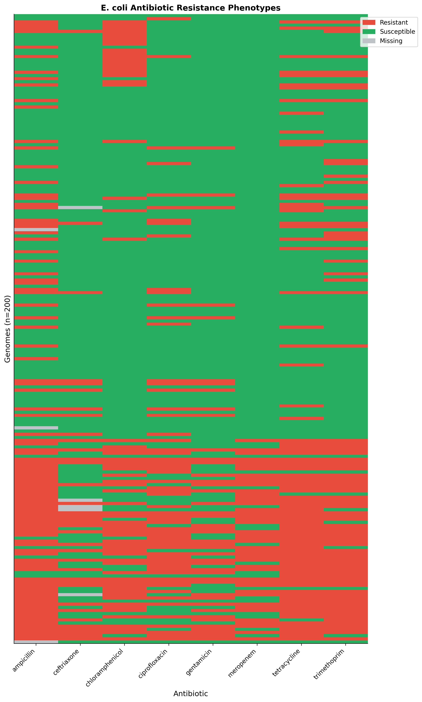
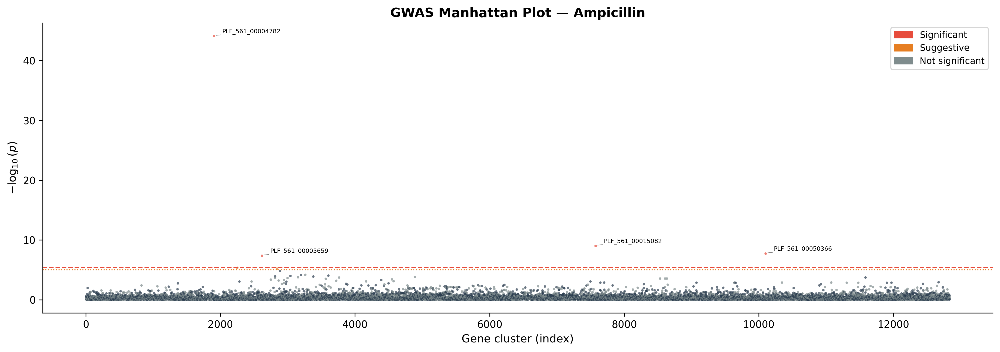
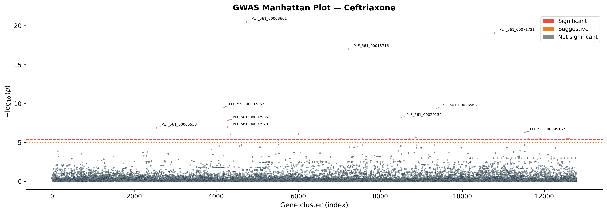
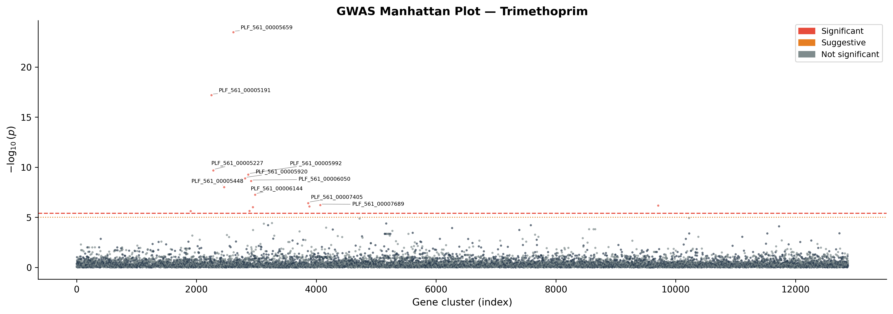
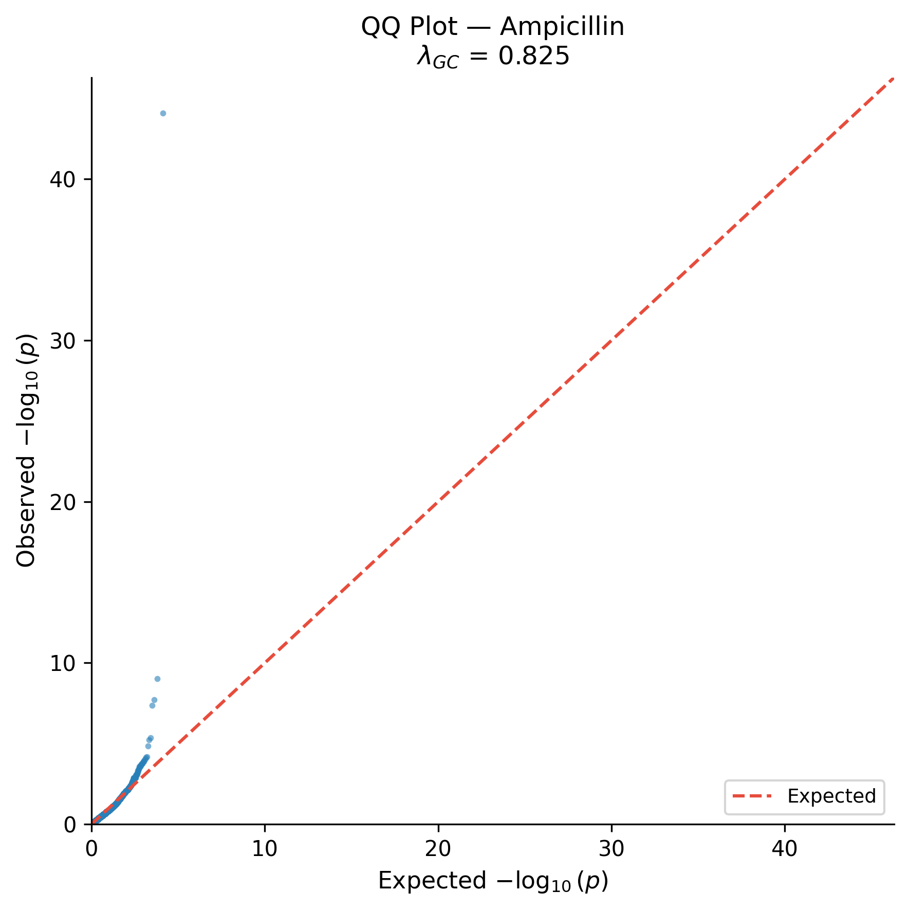

# E. coli GWAS Pipeline

[](https://doi.org/10.5281/zenodo.18968216)


A fully automated pipeline for performing Genome-Wide Association Studies (GWAS) on *Escherichia coli* to identify genomic loci (genes) associated with antibiotic resistance.

**Intended use:** At default settings (200 genomes, gene presence/absence input), this pipeline is suited for **demonstration and teaching**—it shows the full workflow from BV-BRC data to pyseer LMM and visualisation. For publication-grade or hypothesis-driven GWAS, see [Methodological considerations](#methodological-considerations-current-vs-production) below.

---

## Results (v1.0.0 run — 200 genomes, 8 antibiotics)

### Resistance prevalence across antibiotics



*Binary resistance heatmap across 200 E. coli genomes and 8 antibiotics. Each cell = resistant (1) or susceptible (0).*

---

### Manhattan plots — significant gene associations

**Ampicillin** — strongest hit: `PLF_561_00004782` at p = 8×10⁻⁴⁵ (likely β-lactamase)



**Ceftriaxone** — 23 significant hits, top hit `PLF_561_00008661` at p = 3×10⁻²¹



**Trimethoprim** — 15 significant hits, top hit `PLF_561_00005659` at p = 3×10⁻²⁴



---

### QQ plot — model calibration



*QQ plot for ampicillin. Inflation at the tail indicates real signal; the LMM population structure correction keeps the bulk of the distribution on the null line.*

---

### Summary of significant hits

| Antibiotic | Significant hits (Bonferroni p < 3.88×10⁻⁶) |
|------------|----------------------------------------------|
| Ampicillin | 4 |
| Ceftriaxone | 23 |
| Chloramphenicol | 18 |
| Ciprofloxacin | 3 |
| Gentamicin | 17 |
| Meropenem | 26 |
| Tetracycline | 12 |
| Trimethoprim | 15 |
| **Total** | **118** |

Full results in [`data/gwas/results/all_significant_hits.tsv`](data/gwas/results/) after running the pipeline.

---

## What it does

This pipeline downloads publicly available *E. coli* genomes and AMR (antimicrobial resistance) phenotypes from the [BV-BRC database](https://www.bv-brc.org/), runs quality control, builds a pangenome presence/absence matrix, and uses **pyseer** with a Linear Mixed Model (LMM) to correct for population structure while identifying resistance-associated genes. Results are visualised as Manhattan plots, QQ plots, and a resistance heatmap.

### Antibiotics tested (by default)
ciprofloxacin, ampicillin, tetracycline, trimethoprim, ceftriaxone, meropenem, gentamicin, chloramphenicol

### Design rationale

- **BV-BRC integration**: The pipeline uses the BV-BRC public REST API to download genomes and AMR phenotypes automatically. This is a practical convenience, not a unique capability—the value is in having a single, scripted workflow from data to results.
- **Dual-path pangenome**: The main architectural feature is the choice between two gene presence/absence workflows. The **fast path** uses BV-BRC’s pre-computed protein family (plfam) data via their API, avoiding local annotation. The **slow path** runs Prokka and Panaroo locally, giving full control over annotation and pangenome parameters at the cost of compute time. One config switch (`use_bvbrc_pa_matrix: true` or `false`) selects the path, so users can trade speed for control without changing code.

---

## Pipeline steps

| Step | Script | Description |
|------|--------|-------------|
| 1 | `01_download_data.py` | Download up to 200 *E. coli* genomes + AMR phenotypes from BV-BRC API |
| 2 | `02_qc_genomes.py` | Filter genomes by length, contig count, N50, and GC content |
| 3 | `03_prepare_phenotypes.py` | Build a binary (R/S) phenotype matrix per antibiotic |
| 4 | `04_build_pa_matrix.py` | Build gene presence/absence matrix: **fast path** = BV-BRC plfam API (one request per genome); **slow path** = from Panaroo output (run 04b and 05 first) |
| — | `04b_run_prokka.py` | *(Slow path only)* Annotate genomes with Prokka |
| — | `05_run_panaroo.py` | *(Slow path only)* Build pangenome with Panaroo |
| 5 | `06_run_gwas.py` | Compute Mash distances, run pyseer LMM per antibiotic, apply Bonferroni correction |
| 6 | `07_visualize.py` | Generate Manhattan plots, QQ plots, and resistance heatmap |

**Slow path order:** If `use_bvbrc_pa_matrix: false`, run `04b_run_prokka.py` → `05_run_panaroo.py` → `04_build_pa_matrix.py` before `06_run_gwas.py`.

---

## Requirements

### System tools (must be on PATH)

- **mash** — for computing genomic distances (used by the GWAS step).
- **Prokka** and **Panaroo** — only needed for the **slow path** (`use_bvbrc_pa_matrix: false`). Prokka requires **tbl2asn** on `PATH`. NCBI has retired tbl2asn in favour of table2asn, which is not a drop-in for Prokka. The most reliable way to run the slow path is to install Prokka via **Conda**: `conda install -c bioconda prokka`. On macOS, `brew install prokka` plus `prokka --setupdb` may work, but tbl2asn is no longer distributed by NCBI, so the slow path is best used with a Conda Prokka environment.

### Python packages
```
pip install -r requirements.txt
```

Or use the provided conda environment:
```
conda env create -f environment.yml
conda activate ecoli_gwas
```

---

## Quick start

```bash
# 1. Clone / navigate to the project
cd ecoli_gwas

# 2. Create and activate a virtual environment
python -m venv venv
source venv/bin/activate
pip install -r requirements.txt

# 3. (Optional) Edit config/config.yaml to adjust cohort size, QC thresholds, antibiotics, etc.

# 4. Run the full pipeline (uses fast path by default)
bash run_pipeline.sh
```

Step 4 (gene presence/absence) uses the BV-BRC API with one request per genome and can take roughly 10–30 minutes for 200 genomes.

### Running the slow path (Prokka + Panaroo)

If you set `use_bvbrc_pa_matrix: false` in `config/config.yaml`, run the pipeline in this order (step 4 uses Panaroo output instead of the API):

```bash
venv/bin/python scripts/01_download_data.py
venv/bin/python scripts/02_qc_genomes.py
venv/bin/python scripts/03_prepare_phenotypes.py
venv/bin/python scripts/04b_run_prokka.py    # annotate genomes
venv/bin/python scripts/05_run_panaroo.py     # build pangenome
venv/bin/python scripts/04_build_pa_matrix.py # build PA matrix from Panaroo
venv/bin/python scripts/06_run_gwas.py
venv/bin/python scripts/07_visualize.py
```

Ensure Prokka (and tbl2asn) and Panaroo are on your `PATH`; see **Requirements**.

---

## Configuration

All parameters are in `config/config.yaml`:

| Section | Key | Default | Description |
|---------|-----|---------|-------------|
| `cohort` | `target_genomes` | 200 | Max genomes to download |
| `cohort` | `use_bvbrc_pa_matrix` | `true` | Fast path (BV-BRC) vs slow path (Prokka+Panaroo) |
| `qc` | `min_length` / `max_length` | 4–6.5 Mbp | Genome size filter |
| `qc` | `max_contigs` | 500 | Assembly fragmentation filter |
| `qc` | `min_n50` | 10 000 bp | Assembly quality filter |
| `gwas` | `lmm` | `true` | Use LMM for population structure correction |
| `gwas` | `significance_alpha` | 0.05 | Bonferroni significance level |
| `phenotypes` | `min_resistant` / `min_susceptible` | 20 | Minimum class size per antibiotic |

---

## Outputs

```
data/processed/pangenome/
  gene_pa_matrix.tsv           # Gene presence/absence matrix (input to GWAS)

results/
  figures/
    manhattan_<antibiotic>.png   # Manhattan plot per antibiotic
    qq_<antibiotic>.png          # QQ plot per antibiotic
    resistance_heatmap.png       # Heatmap of resistance prevalence
  significant_hits_summary.tsv  # All significant gene associations

data/gwas/results/
  <antibiotic>_gwas.tsv         # Full pyseer output per antibiotic
  <antibiotic>_significant.tsv  # Significant hits per antibiotic

logs/                            # Per-step log files
```

---

## Project structure

```
ecoli_gwas/
├── config/
│   └── config.yaml          # All pipeline parameters
├── data/
│   ├── raw/                 # Downloaded genomes and AMR data
│   ├── processed/           # QC-filtered genomes, phenotypes, pangenome
│   └── gwas/                # GWAS inputs and results
├── scripts/
│   ├── 01_download_data.py
│   ├── 02_qc_genomes.py
│   ├── 03_prepare_phenotypes.py
│   ├── 04_build_pa_matrix.py
│   ├── 04b_run_prokka.py    # Optional: Prokka annotation (slow path)
│   ├── 05_run_panaroo.py    # Optional: Panaroo pangenome (slow path)
│   ├── 06_run_gwas.py
│   └── 07_visualize.py
├── notebooks/               # Exploratory Jupyter notebooks
├── results/                 # Final figures and summary tables
├── logs/                    # Pipeline logs
├── run_pipeline.sh          # One-command pipeline runner
├── requirements.txt
└── environment.yml
```

---

## Data source

Genomes and AMR phenotypes are fetched from the **BV-BRC** (Bacterial and Viral Bioinformatics Resource Center) public REST API using taxon ID `562` (*E. coli*).

---

## Citation

If you use this pipeline in your research, please cite the software and the Zenodo archive:

- **Software**: See [CITATION.cff](CITATION.cff) or the "Cite this repository" widget on GitHub.
- **Zenodo**: `Younis, A. B. (2026). E. coli GWAS Pipeline (Version 1.0.2) [Software]. Zenodo. https://doi.org/10.5281/zenodo.18968216.`

Reproducibility is supported through standard practice: a machine-readable citation (CITATION.cff), pinned dependencies (`requirements.txt`, `environment.yml`), and a single configuration file (`config/config.yaml`) so runs can be repeated and verified.

---

## Method notes

- **Population structure correction**: Mash sketch distances are converted to a similarity matrix and used as the kinship matrix in pyseer's LMM mode, reducing false positives caused by phylogenetic relatedness. Mash is a pragmatic approximation; core-genome SNP– or kmer-based kinship would be more accurate for closely related strains (see [Methodological considerations](#methodological-considerations-current-vs-production)).
- **Multiple testing**: Bonferroni correction is applied using the number of unique k-mer/gene patterns rather than raw variant count, as recommended by pyseer.
- **Fast vs slow pangenome path**: The fast path queries BV-BRC's pre-computed protein family (plfam) presence/absence (one API call per genome to avoid server limits). Set `use_bvbrc_pa_matrix: false` in the config to use Prokka+Panaroo instead; see **Requirements** for Prokka/tbl2asn caveats.

## Troubleshooting

- **Step 4 returns 400 Bad Request**: The script uses a hand-built query string for the BV-BRC API (no trailing `=` on parameters). If the API changes, the request format in `04_build_pa_matrix.py` may need updating.
- **Prokka fails with "Can't find required 'tbl2asn'"**: Install Prokka via Conda (`conda install -c bioconda prokka`) so that tbl2asn is available, or use the fast path (`use_bvbrc_pa_matrix: true`).
- **Prokka joblib pickle error**: The pipeline uses `prefer="threads"` in the Prokka parallel step to avoid serialising the logger; ensure you have the latest `04b_run_prokka.py` if you see a pickling error.

## Limitations and scope

- **API and data dependency**: The pipeline depends on the BV-BRC public API and their current data (genomes, AMR phenotypes, and for the fast path, plfam annotations). Changes in API or data availability may require updates to the scripts.
- **Fast path**: Gene presence/absence in the fast path is defined by BV-BRC's pre-computed annotations. For custom annotation or different pangenome criteria, use the slow path (Prokka + Panaroo).
- **Zenodo DOI**: The badge and citation refer to a Zenodo DOI that is assigned only after the repository is connected to Zenodo and a release is created. Until then, the placeholder `XXXXXXX` remains; cite the GitHub repository and/or CITATION.cff for the software itself.
- **Phenotypes**: Only "Resistant" and "Susceptible" are used; intermediate (or other) AMR calls are treated as missing and excluded from the phenotype matrix for that antibiotic.

## Methodological considerations (current vs. production)

The following table summarises the current implementation versus what is typically required for well-powered, publication-grade bacterial GWAS. Acknowledging these gaps helps set expectations and clarifies the pipeline’s scope.

| Aspect | Current implementation | Minimum for production-style GWAS |
|--------|------------------------|-----------------------------------|
| **Sample size** | 200 genomes (configurable ceiling) | 1,000–5,000+ genomes for adequate power after multiple-testing correction |
| **Variant input** | Gene presence/absence only | Unitigs (e.g. pyseer’s unitig-counter / fsm-lite) to capture both SNP-level and gene-level variation; many resistance mechanisms are SNPs in core genes (e.g. *gyrA* for fluoroquinolones, PBP for β-lactams) |
| **Kinship / population structure** | Mash sketch distances → similarity matrix | Core-genome SNP-based kinship or kmer-based similarity; Mash is a pragmatic approximation and can be noisy for closely related strains |
| **Biological validation** | None — output is p-values and gene names | Cross-reference hits against CARD, ResFinder, or AMRFinderPlus (or similar) for biological interpretation |
| **Phylogenetic context** | Not included | Core-genome or Mash-based tree with resistance phenotypes overlaid to assess clonal expansion vs. independent association |
| **Intermediate phenotypes** | Excluded (treated as missing) | Documented policy: exclude, merge with R, or model explicitly (e.g. ordinal); currently excluded |
| **Containerization** | None (requirements.txt, environment.yml only) | Docker or Singularity recipe for full reproducibility including system tools (Mash, Prokka, Panaroo) |
| **QC strictness** | Defaults: max 500 contigs, min N50 10 kb | Stricter assembly QC is common in production (e.g. lower max contigs, higher N50) |

**Summary:** This pipeline demonstrates the integration of BV-BRC, pangenome presence/absence, and pyseer LMM in a single workflow. To move toward production-quality GWAS, the main additions would be: (1) unitig-based (or other SNP-aware) variant input, (2) larger or configurable cohort size, (3) an automated validation step against known AMR databases, and (4) optional containerization and phylogenetic visualisation.
